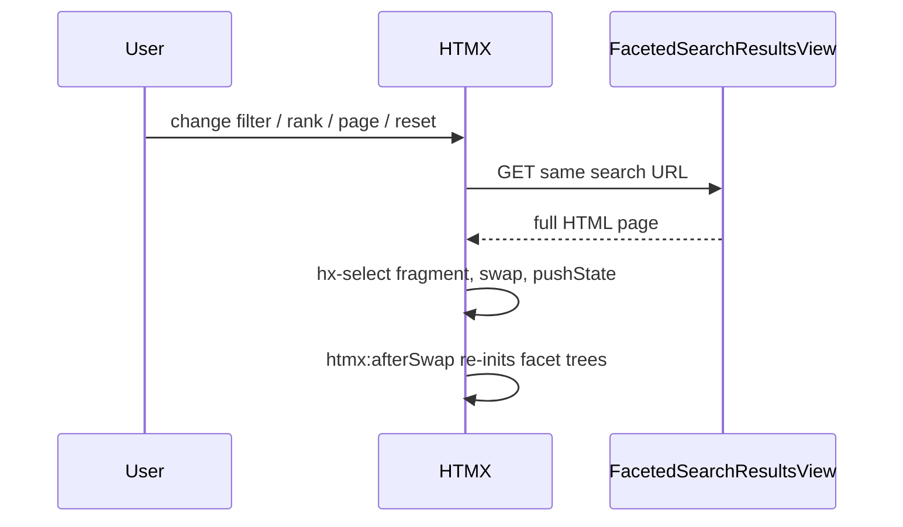

# Background refresh for faceted search (HTMX)

Keep the current GET form and view. Return the same full HTML page. HTMX requests that page, extracts the changing regions, swaps them in, and updates the URL.

Search-box submit stays a native full-page GET. Filters, rank-by, pagination, and Reset filters use HTMX.



## Why HTMX here

HTMX is a small JS library: you put attributes on HTML (`hx-get`, `hx-target`, `hx-select`, `hx-push-url`) and it fetches HTML and swaps a region. That is this feature. It also aborts in-flight requests, restores on Back (`hx-push-url` + history), and processes HTMX attrs in the swapped markup (pagination/reset after the first swap).

The Python view stays unchanged. No JSON API, no fragment templates.

## Markup

Wrap sidebar + results (not the search bar) in a stable target in `faceted_search/templates/faceted_search/search_results.html` via a `search_layout` block in the parent template:

```html
<div id="faceted-search-swap"
     hx-get=""
     hx-trigger="change from:[form='faceted-search-form']"
     hx-include="#faceted-search-form"
     hx-target="this"
     hx-select="#faceted-search-swap"
     hx-push-url="true"
     hx-sync="this:replace">
  {# sidebar + #search-results #}
</div>
```

- `hx-trigger` is **change only**, not `submit`, so the search button keeps a full reload.
- The search box is inside the form (no `form=` attribute), so `from:[form='faceted-search-form']` does not listen to it.
- `page` is not a form field, so filter changes already reset to page 1.
- Do **not** `hx-boost` the whole swap region (result card links must stay normal navigations).

Pagination: wrap `` with the same `hx-target` / `hx-select` / `hx-push-url` via `hx-boost="true"` on that nav wrapper only.

Reset link in `faceted_search/templates/faceted_search/blocks/search_facets.html`: `hx-boost` + same target/select/push-url.

Remove inline `onchange="this.form.submit()"` from:

- list checkboxes in `faceted_search/templates/faceted_search/blocks/facet_value_list.html`
- `DateInput` and `RankBySelect` in `faceted_search/forms.py`

No-JS: users tick filters then click **Search**.

## HTMX asset

Vendor [htmx 2](https://htmx.org/) as `faceted_search/static/faceted_search/js/htmx.min.js` (no CDN; fits CSP / no extra third-party host). Load it in `extra_js` **before** `facet_tree.js`. Do not add `django-htmx`; full-page + `hx-select` is enough.

## Tree JS

In `faceted_search/static/faceted_search/js/facet_tree.js`, drop `checkbox.form.submit()`. The original `change` bubbles after parent/child sync (listener on the `ul` runs first). Re-run tree init on `htmx:afterSwap` (new trees are new nodes). Guard so the first page load does not double-bind.

DSFR 1.14 observes DOM mutations. Confirm accordions/pagination still work after swap; if not, call `dsfr.start()` in `htmx:afterSwap`.

## Tests

Update HTML assertions that require inline `onchange`:

- `faceted_search/tests/test_forms.py` `test_renders_native_date_inputs`
- `faceted_search/tests/test_facets.py` date facet `onchange` checks

Assert list checkboxes have no `onchange`. Assert `htmx.min.js` is on the page and `#faceted-search-swap` has `hx-get` / `hx-select`.

Verify in the browser: change a theme, change rank-by, paginate, reset, then Back. Confirm publication links in results still do a full navigation.

## Out of scope

- New API or partial templates
- AJAX for the search box
- Preserving which facet accordion the user collapsed (full reload today always reopens them all)
