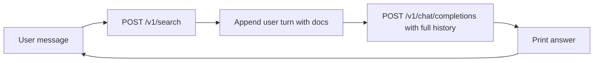

# Multi-turn Albert RAG chat

How to extend the one-shot RAG script into a back-and-forth conversation (clarifications and follow-up questions).

## Relation to Albert documentation

**Partially aligned — not a documented multi-turn RAG recipe.**

What Albert **does** document:

1. **Decoupled RAG (search → prompt → chat)** — [RAG guide](https://guides.ia.numerique.gouv.fr/albert-api/guides/rag.md):

   > Il est aussi possible de dissocier la recherche du chat. Cela permet davantage de contrôle sur les chunks sélectionnés […]
   > 1. **Recherche** — `POST /v1/search` […]
   > 2. **Prompt** — concaténation des `chunk.content` […]
   > 3. **Chat** — `POST /v1/chat/completions` avec le prompt enrichi.

   The same guide’s Step 3 example is **single-turn** only: one `system` + one `user` message with excerpts ([RAG – Step 3](https://guides.ia.numerique.gouv.fr/albert-api/guides/rag.md)).

2. **Chat Completions as OpenAI-style `messages`** — [Chat completions](https://guides.ia.numerique.gouv.fr/albert-api/guides/chat-completions.md):

   > Le corps de requête et la réponse s’inspirent du modèle **OpenAI Chat Completions** : `messages`, […]

   That API shape **allows** multi-turn histories (`user` / `assistant` alternating), but the guide does **not** prescribe how to combine conversation history with RAG.

What Albert does **not** document (as of the current RAG / chat guides):

- An interactive back-and-forth RAG chat loop
- Whether to re-run `/v1/search` on every user turn vs reuse prior chunks
- How to structure `messages` when each turn has its own retrieved documents

So this approach **reuses** the official search→prompt→chat split and the OpenAI-compatible `messages` array; the multi-turn orchestration (history + re-search each turn) is an application choice, not an Albert “recommended conversation pattern” with a dedicated page.

## How it works today

[`scripts/albert/albert_rag_query.py`](../../scripts/albert/albert_rag_query.py) builds a one-shot `messages` list (`system` + one `user`) and calls `POST /v1/chat/completions` once. Albert’s chat API already supports multi-turn: pass prior `user` / `assistant` messages in the same array. The script just never loops or keeps history.

## Recommended approach: interactive `--chat` with re-search each turn



**Behaviour**

1. Add `--chat` (query positional becomes optional). If `--chat` and a query are given, that query is the first turn; otherwise prompt `You> ` on stdin.
2. Keep `messages = [{"role": "system", "content": system_prompt}]` for the session.
3. On each user line:
   - Run hybrid search on **that** line (same as today: collection, limit, method).
   - Print compact retrieval (existing behaviour).
   - Append `{"role": "user", "content": build_user_prompt(text, hits, ...)}`.
   - Call chat with the **full** `messages` history.
   - Append `{"role": "assistant", "content": answer}` and print the answer.
4. Session commands: `/exit` (or EOF), `/clear` (reset history to system only), `/help`.
5. Update justfile with e.g. `albert-rag-chat *ARGS` → `python scripts/albert/albert_rag_query.py --chat {{ARGS}}`.

**Why re-search every turn:** follow-ups like « et pour le maïs ? » need new chunks; clarifications like « précise la source » still benefit from the same docs being retrieved again (or nearby). Skipping search for clarifications is a later optimization.

**Why not only one search then chat:** clarifications would work, but new topics would answer from stale excerpts and invent or refuse wrongly.

## Prompt / history hygiene

- Keep the existing system prompt (sources = filename + page when metadata exists).
- Each user turn embeds its own `[Documents]` block via `build_user_prompt` so the model sees which corpus supports **this** question; prior turns remain in history for continuity.
- No query rewriting in v1 (no extra LLM call).

## Example: body sent to `POST /v1/chat/completions` (2nd turn)

After the user asked about wheat, got an answer, then asked « et pour le maïs ? », the request looks like this (abbreviated document text):

```json
{
  "model": "openweight-large",
  "stream": false,
  "messages": [
    {
      "role": "system",
      "content": "Réponds uniquement en t'appuyant sur les documents fournis..."
    },
    {
      "role": "user",
      "content": "[Question]\nQuelle est la production de blé en 2024 ?\n\n[Documents]\n---\ndocument_name: IraBle2024.pdf\ndocument_id: 4793561\nchunk_id: 4\ncontent:\nLa production de blé tendre..."
    },
    {
      "role": "assistant",
      "content": "En 2024, la production de blé tendre est estimée à …\n\nSources:\n- IraBle2024.pdf, page (unknown)"
    },
    {
      "role": "user",
      "content": "[Question]\net pour le maïs ?\n\n[Documents]\n---\ndocument_name: IraMais2024.pdf\ndocument_id: 4793600\nchunk_id: 2\ncontent:\nLa production de maïs grain..."
    }
  ]
}
```

Notes:

- Turn 1 user message includes search hits for the wheat query; turn 2 includes **new** hits for the maize follow-up.
- The assistant reply from turn 1 is kept so the model has conversational context.
- After the API responds, the script appends that assistant message and waits for the next `You>` line.

## Out of scope (v1)

- Web UI / streaming tokens.
- Persisting conversations to disk.
- Skipping retrieval on “clarification-only” turns.

## Next implementation step

Add `--chat` to [`scripts/albert/albert_rag_query.py`](../../scripts/albert/albert_rag_query.py) and a `just albert-rag-chat` recipe.
