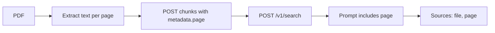

# Getting PDF page numbers into Albert RAG sources

## Why it does not work today

The RAG system prompt asks for « nom de fichier, numéro de page », but search hits have no page field. Current ingest ([`scripts/albert/upload_albert_documents.py`](../../scripts/albert/upload_albert_documents.py)) uses Albert’s default `POST /v1/documents` path:

- Albert parses the PDF, then splits with `RecursiveCharacterTextSplitter` (`chunk_size` default **2048** characters).
- That splitter is **not page-aware**. Chunk boundaries ignore PDF pages.
- Optional upload `metadata` is applied **the same** to every chunk of the file — you cannot pass a different page per chunk on the simple file upload.
- So retrieval can show `document_id` / `chunk_id`, but not a reliable page number.

You only get page citations if **each retrieved chunk carries `metadata.page` (or similar)** that you set at ingest, then the RAG script puts that into the prompt (and Sources).

## Method A (recommended): 1 chunk = 1 page, custom Albert chunks

**How**

1. Client-side: extract text per page (`pypdf` / PyMuPDF — already used in corpus notes).
2. Create an Albert document **without** auto-split content, e.g. upload with `disable_chunking=true`, or create a named document then fill via `POST /v1/documents/{document_id}/chunks`.
3. For each page, send a chunk: `content` = page text, `metadata` = `{"page": 1, "document_name": "Rap.pdf"}` (1-based page for users).
4. Update [`albert_rag_query.py`](../../scripts/albert/albert_rag_query.py) to read `chunk.metadata.page` into the prompt and Sources (drop `chunk_id` for end users).
5. Re-ingest the collection (existing character-split docs cannot be retrofitted with pages without re-upload).

**Drawbacks of 1 page = 1 chunk**

- **Uneven size**: blank/TOC pages → weak chunks; dense Agreste pages (~400–600 tokens) → large embeddings, noisier match.
- **No cross-page continuity**: answers that span page 4–5 lose shared context unless you add overlap (e.g. append last N chars of previous page).
- **Tables/figures** cut at page breaks.
- **More chunks** ≈ more embeddings / storage; corpus notes estimate ~**37k pages** for the full PDF set (quota-sensitive under Albert’s collection limits).
- **OCR gap**: image-only pages need OCR first (`/v1/ocr` or local) or empty chunks.

Still the best tradeoff when the product requirement is « cite the PDF page ».

## Method B: Character chunks with page **range** in metadata

Keep smaller semantic chunks (~512–1024 chars), but when splitting, track which PDF page(s) each character span came from; store `page` or `page_start`/`page_end` in metadata.

- Better retrieval quality than whole pages.
- Sources become « p. 12–13 » when a chunk crosses a boundary.
- More implementation work (page-aware splitter), still custom `POST .../chunks`.

## Method C: One Albert **document** per page

Upload `Rap.pdf — page 3` as separate documents (name encodes page).

- Simple mentally; citation = document name.
- Explodes document count; listing/managing collections painful; multi-page answers cite many « documents ».

## Method D: Markers in text only (`[Page 12]\n...`)

Inject page headers into content, rely on the LLM to repeat them in Sources.

- No structured metadata; model may invent or omit pages. Weak for trustworthy citations.

## Method E: Guess page after retrieval

Map `chunk_id` or character offset back to a local PDF. Fragile if Albert’s parse ≠ your local extract; needs the file on disk at query time.

## Method F: OCR / parse APIs

Albert OCR responses can include page-oriented structure; useful for scanned PDFs, then feed Method A/B. Does not by itself fix already-uploaded character-split collections.

## What will **not** work

- Asking the chat model for a page number without page metadata (hallucination risk).
- Passing a single `metadata={"page": ...}` on `POST /v1/documents` file upload — same page for all chunks.
- Expecting default Albert PDF upload to populate `metadata.page` (not part of the documented create-document chunking behaviour).

## Practical recommendation for Agreste

1. **Re-ingest** curated PDFs with **Method A** (page chunks + `metadata.page`), optional small overlap across pages.
2. Cap corpus to stay under collection token limits (see [`docs/rag-with-albert-corpus-size.md`](../rag-with-albert-corpus-size.md)).
3. Extend the upload script (e.g. `--chunk-by page`) and the RAG script to surface `page` in retrieval + prompt.
4. If retrieval quality drops on long bulletins, move to **Method B** (sub-page chunks with page ranges).

## Next implementation step

Method A on [`scripts/albert/`](../../scripts/albert/): page extract → custom chunks with `metadata.page` → RAG prompt/Sources include page.
