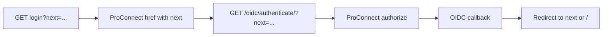

# Security analysis: ProConnect `next` redirect

Review note for the change that passes `next` on the ProConnect login button.
It is not part of the published documentation nav.

## Change under review

The ProConnect button in `sites_conformes/dashboard/templates/wagtailadmin/login.html`
now forwards the post-login destination:

```django

<a class="fr-connect"
   href="?next={{ next|default:home_url|urlencode }}">
```

`` is resolved on the server. The HTML only contains
the path (by default `/cms-admin/`, or whatever `WAGTAILADMIN_PATH` is). The Django
URL name is never sent to the browser.

The password form already used the same default in a hidden field:

```django
<input type="hidden" name="next" value="{{ next|default:home_url }}" />
```

## Data flow



1. An unauthenticated visit to `/cms-admin/` (or a deeper admin URL) redirects to
   the Wagtail login page with `?next=...`.
2. The ProConnect link points at `/oidc/authenticate/?next=...`.
3. `mozilla-django-oidc` stores a **safe** `next` in the session as `oidc_login_next`,
   then redirects to ProConnect. The OIDC `redirect_uri` is always the callback
   (`/oidc/callback/`). `next` is not an OIDC parameter.
4. After login, the callback redirects to `oidc_login_next`, or to
   `LOGIN_REDIRECT_URL` (`/`) if that session value is missing.

## Trust boundary

`next` is attacker-controlled: it can appear on the login page query string, or
directly on `/oidc/authenticate/?next=...`.

Two independent checks already existed; this change does not add a third.

1. **Wagtail / Django login view.** `RedirectURLMixin.get_redirect_url()` only puts
   `next` in the template context if `url_has_allowed_host_and_scheme` allows it.
   Otherwise the context value is empty and the template falls back to admin home.
   Allowed hosts here are `{request.get_host()}` by default.
2. **OIDC init** (`GET /oidc/authenticate/`). `mozilla-django-oidc.get_next_url()`
   runs the same helper before writing `oidc_login_next`. Unsafe values become
   `None`. Allowed hosts are `OIDC_REDIRECT_ALLOWED_HOSTS` (`ALLOWED_HOSTS`) plus
   `request.get_host()`. `OIDC_REDIRECT_REQUIRE_HTTPS` defaults to
   `request.is_secure()`.

The callback does not re-check the URL; it trusts the value already stored in the
session.

Hitting `/oidc/authenticate/?next=...` directly is the real open-redirect surface.
That endpoint accepted `next` before this patch. The login page now forwards a
value Django has already filtered.

## Findings

### Open redirect

**Risk:** trick a user into logging in, then send them to an attacker site.

**Mitigation:** both layers reject off-site URLs. The first hop from
`/oidc/authenticate/` is always ProConnect (or an error), never `next`. `next` is
only used after the callback, and only if it passed the host/scheme check.

**Residual:** a same-origin `next` (for example `/`) is allowed. That is intended.
If `ALLOWED_HOSTS` lists extra hosts, mozilla-django-oidc may accept a `next` that
the login view would have stripped. An attacker would still have to send the
victim straight to `/oidc/authenticate/`.

This change does not widen that surface; it only wires the login button to a
parameter the OIDC view already read.

### Admin path disclosure

**Risk:** revealing `` or the admin prefix.

**Mitigation / fact:** the URL name never appears in HTML. The path
(`/cms-admin/` by default) already appears in:

- the login page URL (`/{WAGTAILADMIN_PATH}login/`);
- the password form’s hidden `next` field (unchanged behaviour).

Hiding `WAGTAILADMIN_PATH` is not access control. Anyone who can load the login
page already knows the prefix.

### Access control bypass

**Risk:** `next=/cms-admin/` grants CMS access.

**Fact:** it only chooses the landing page after a successful login. Wagtail still
requires `wagtailadmin.access_admin`. If 2FA is required, `wagtail-2fa` still
runs.

### XSS and query injection

**Risk:** `next` breaks out of the `href` or injects extra query parameters.

**Mitigation:** the `href` always starts at `/oidc/authenticate/`. `next` is a
query **value**, passed through `|urlencode` then Django auto-escape. A payload
such as `javascript:alert(1)` becomes `?next=javascript%3A...`, not a
`javascript:` URL. After login, a rejected `next` is not used as `Location`.

### Referer leak to ProConnect

**Risk:** the browser sends `/oidc/authenticate/?next=...` as `Referer` to
ProConnect.

**Mitigation:** `SECURE_REFERRER_POLICY` is `strict-origin-when-cross-origin`.
On HTTPS to HTTPS, the cross-origin request should send the origin only, not the
path or query. `next` is not included in the authorize query string.

A `next` that is only a local path (admin URL) is not a secret even if it leaked.

## What this change does not affect

- OIDC `redirect_uri`, client ID, or client secret
- token handling in `sites_conformes.proconnect.backends`
- logout / `post_logout_redirect_uri`
- who is allowed to use the CMS

## Manual tests

Replace `http://localhost:8000` with the instance under test. If
`WAGTAILADMIN_PATH` is not `cms-admin/`, adjust paths. Use an account that can
complete ProConnect login.

For each case: **safe** is the expected result. **Attack succeeded** is what
failure looks like.

### 1. Happy path

1. Log out.
2. Open `http://localhost:8000/cms-admin/`.
3. Click **Login with ProConnect** and complete login.

**Safe:** you land on the admin home, authenticated.

**Attack succeeded:** not applicable; this is the intended behaviour.

### 2. Deep link

1. Log out.
2. Open `http://localhost:8000/cms-admin/pages/`.
3. Complete ProConnect login.

**Safe:** you land on `/cms-admin/pages/`.

**Attack succeeded:** you land on `/` and must navigate to admin again (the bug
this change fixes).

### 3. Login page strips an external `next`

1. Log out.
2. Open `http://localhost:8000/cms-admin/login/?next=https://example.com`.
3. View the ProConnect button `href` (view source or DevTools).

**Safe:** the `href` is `/oidc/authenticate/?next=...` and the encoded `next` is
the admin home (for example `/cms-admin/`). It must not contain `example.com`.

**Attack succeeded:** `example.com` appears in the ProConnect `href`.

### 4. Direct OIDC init (main open-redirect test)

1. Log out.
2. Open DevTools → Network, preserve log.
3. Visit `http://localhost:8000/oidc/authenticate/?next=https://example.com`.
4. Complete ProConnect login.

**Safe:**

- The first response from `/oidc/authenticate/` is a redirect to ProConnect, not
  to `example.com`.
- After the callback, the final `Location` is `/` (`LOGIN_REDIRECT_URL`), not
  `https://example.com`.

**Attack succeeded:** after login, the browser opens `https://example.com`.

### 5. Classic bypass payloads

Repeat **test 3** (login page, inspect `href`) and **test 4** (direct
`/oidc/authenticate/`, complete login) for each value of `next`:

| Payload | Notes |
| --- | --- |
| `//example.com` | protocol-relative URL |
| `javascript:alert(1)` | script URL |
| `/\example.com` | backslash trick |
| `https://example.com/@localhost:8000` | userinfo / host confusion; use your real host in place of `localhost:8000` |

**Safe:** login-page `href` does not use the attacker host; after a direct OIDC
init, final destination is `/` (or another same-origin path), never `example.com`.
`javascript:` is never used as a redirect target or as the ProConnect `href`.

**Attack succeeded:** the browser leaves the site for `example.com`, or executes
script from the `next` value.

### 6. On-site `next` is allowed

1. Log out.
2. Visit `http://localhost:8000/oidc/authenticate/?next=/`.
3. Complete ProConnect login.

**Safe:** you land on `/`. This is a same-origin redirect, not an open redirect.

**Attack succeeded:** not applicable if the destination is your own origin.

### 7. User without admin access

1. Use a ProConnect account that can log in but does **not** have
   `wagtailadmin.access_admin`.
2. Open `http://localhost:8000/cms-admin/` (or login with
   `?next=/cms-admin/`).
3. Complete ProConnect login.

**Safe:** you are authenticated but do not get a working CMS. Wagtail should deny
admin access (forbidden, or login with an “unauthorized account” message).

**Attack succeeded:** the user can use the Wagtail admin.

If 2FA is enabled (`WAGTAIL_2FA_REQUIRED`), also confirm that a user without a
verified device is sent to 2FA setup/verify and cannot skip it via `next`.

### 8. Referer to ProConnect

1. Log out. Use HTTPS if you can (the referrer policy is most meaningful there).
2. Open DevTools → Network.
3. From the login page, click ProConnect.
4. Inspect the request to the ProConnect authorize endpoint.

**Safe:** `Referer` is the site origin only (for example `https://localhost:8000/`)
or is absent. It must not be the full `/oidc/authenticate/?next=...` URL.

**Attack succeeded:** ProConnect receives the full authenticate URL, including
`next`. That is an information leak, not an open redirect. Note it if you see it,
especially on HTTP.

### 9. View-source disclosure

1. Open the login page.
2. View source and search for `wagtailadmin_home` and `cms-admin` (or your
   `WAGTAILADMIN_PATH`).

**Safe:** the Django URL name `wagtailadmin_home` does not appear. The admin path
does appear in the ProConnect `href` and in the hidden password-form field.

**Attack succeeded:** not a new issue if only the path is visible; it was already
on this page. Treat it as a finding only if the template tag name or other
server-side identifiers leak.

## Automated coverage today

`sites_conformes/dashboard/tests/test_login.py` checks that a safe `next` is
copied onto the ProConnect link, and that the default is admin home. It does not
assert that malicious `next` values are rejected. The checks above cover that
gap manually.
